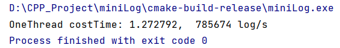

### 当前的性能
在我的i5-7500 16G内存 4核 2.3GHz 的个人pc机上单线程写入一百万条日志平均在2.5s的时间
### 优化的记录
最开始的日志刷入磁盘的方法是每写一条到内存都会立即刷进磁盘，这种情况写需要180s左右。  
考虑到磁盘的写入比较耗时，加入缓冲区组件std::deque，先将日志写到缓冲区，使用单独的写入磁盘线程将日志定期集中写入磁盘，优化到5s。  
从自测的结果看，deque的push和pop比较耗时。因此尝试使用自实现的缓冲区，经多次运行验证后将时间优化到2.3s。  
  
下一步的优化目标：一个chunk写满后通知写入磁盘线程来写，而不是定时睡眠检查chunk的状态再写入。存在多次检查的弊病。
### 使用方法
如果你的编译器支持C++ 11及以上版本，copy头文件和源代码后可以轻松加入到项目中并运行起来。  
具体的使用方法参见main.cpp
