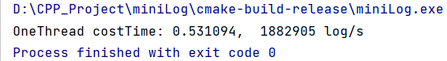
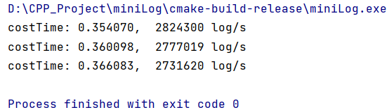

### 当前的性能
在我的i5-7500 16G内存 4核 2.3GHz 的个人pc机上单线程写入一百万条日志平均在0.53s的时间  
  
多线程累计写一百万条日志的总耗时不超过0.37s  

### 设计方法介绍  
本日志系统的设计初衷在于追求使用的简便性、轻量级以及高效性，旨在为开发者提供一种易于集成且开销低廉的日志记录解决方案。  
日志系统包含四个核心类：Logger（单例日志类）、RingChunkBuff（缓冲区类）、Chunk（内存块类）以及一个自实现的自旋锁类。  
Logger类作为日志系统的核心接入点，采用了单例设计模式，以确保其在整个应用生命周期中的全局唯一性。
当开发者调用如LOG_INFO等日志记录方法时，这些方法最终都会导向Logger类内部的一个统一处理函数。
鉴于系统对多线程异步写入能力的需求，Logger类使用了RingChunkBuff作为其异步日志缓冲区。
这意味着，每当有日志数据需要记录时，这些数据会首先被临时存储在缓冲区的内存中，而后台的磁盘写入线程则负责在适当的时候将缓冲区中的数据持久化到文件中。
RingChunkBuff类则实现了一个高效的环形缓冲区机制，该机制由多个Chunk类实例组合而成。
采用Chunk块设计的初衷在于避免使用大块连续的内存空间，每个Chunk都拥有独立的内存区域memory，专门用于存储日志数据。
这种设计不仅提高了内存使用的灵活性，还便于管理。
当一个Chunk被填满日志数据时，信号量+1，指示后台线程将该Chunk中的数据写入到磁盘文件中，从而确保数据的持久性和安全性。   
三者之间的关系如下图所示：  
  
其中writePos是当下日志写入缓存的Chunk位置，具体在Chunk memory的位置由m_u32Used管理。readPos是指刷入磁盘的位置指针，一次写入Chunk整个的memroy。  
本日志系统多线程写入，单线程读取缓存刷入磁盘，所以在写如缓存时需要锁保护。
### 优化的记录
| 序号 | 优化措施 | 描述 | 写入条数 | 写入大小 | 写入时间 |  
| ---- | -------- | ---- | -------- |-------- | -------- |  
| 1    | 初始方法 | 每写一条到内存都会立即刷进磁盘 | 一百万    | 103M    | 180s     |  
| 2    | 加入缓冲区 | 使用`std::deque`作为缓冲区，单独的写入磁盘线程将日志定期集中写入磁盘 | 一百万    | 103M    | 5s       |  
| 3    | 替换缓冲区 | `std::deque`的push和pop比较耗时，替换为自实现的缓冲区 | 一百万    | 103M    | 2.3s     |  
| 4    | 信号量通知 | 刷入磁盘线程定时睡眠检查chunk的状态会出现“空醒”情况，修改为一个chunk写满后用信号量通知写入磁盘线程 | 一百万    | 103M    | 2.2s     |  
| 5    | 修改拼接方式 | 将写日志时使用的字符流拼接方式修改为字符串拼接（+） | 一百万    | 103M    | 1.2s     |  
| 6    | string改为char* | string + 拼接会产生拷贝且性能不够高效，故删除掉string | 一百万    | 103M    | 0.82s   |
| 7    | 减少时间调用次数 | 本日志系统的时间戳的最小单位为秒，不必每条日志都调用一次本地时间转换 | 一百万    | 103M    | 0.59s   |
| 8    | 使用自旋锁 | 使用自实现的自旋锁替换互斥锁 | 一百万    | 103M    | 0.53s   |
| 9    | 下一步计划 | 增加日志常见的简单设置如日志过滤、设置文件名、分文件存储等以及未来的使用网络重定向日志文件到指定ip主机等 | 一百万    | 103M    | 待验证   |

### 使用方法
如果你的g++编译器支持C++ 11及以上版本，copy Log下的头文件和源代码后可以轻松加入到项目中并运行起来。  
具体的使用方法参见main.cpp  

### 注意事项  
使用时请注意调整适合的CHUNKMEMSIZE、RINGBUFFSIZE的大小，并注意求余计算使用了位运算加速RINGBUFFSIZE设置的大小需为2的n次幂。  
在多线程且日志写入量较大时，可适当的增大RINGBUFFSIZE的大小，而减小每个CHUNKMEMSIZE的大小，即小块快速刷入磁盘。如：#define CHUNKMEMSIZE (1024 * 256) #define RINGBUFFSIZE 64 总 16Mb  
在单线程且日志写入量较大时，可适当的增大每个CHUNKMEMSIZE的大小，即大块慢速刷入磁盘。如：#define CHUNKMEMSIZE (1024 * 1024 * 2) #define RINGBUFFSIZE 8 总16Mb       
在不同性能的机器上可能需要适当的调整，如内存敏感的嵌入式设备可能需要调小内存总大小，而内存充裕的机器可以当使用更大内存。  

